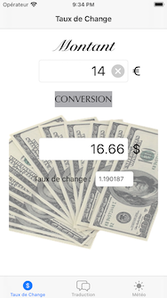
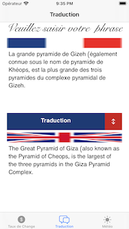
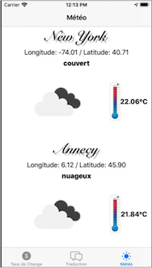

# Le Baluchon
Tools for travelers who offer 
* the conversion of an amount from euro to dollar

* the translation of sentences from English to French and vice versa

* the comparison of the local position weather with NewYork

### SKILLS
* Pattern MVC ( with callback from M to C)
* API Management with supplier data decoupling
* network management 
* Unit tests on the model

### API
* fixer.io to get the current exchange rate
* GoogleTranslate for the sentence translation
* OpenWeatherMap to get the weather and the associated pictos

### PODS
* swiftlink 